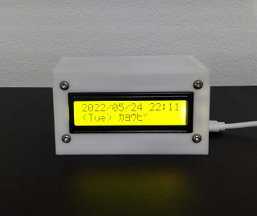
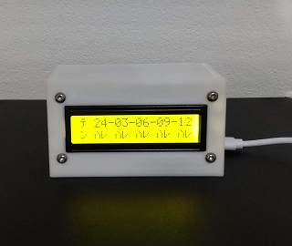

# weather_info_lcd

 

## 概要
* 日本国内向けの天気予報表示器です (This terminal is for use in Japan)
* 3時間ごとの天気、気温、風速、雨量レベル、降水確率を表示します
* 食卓付近に設置して朝食を取りながら今日の天気予報を確認するような使い方を想定します
  * 特に小中学生がいるご家庭で日中の地元の天気によって服装や持ち物を考える教育に使いたいと考えています
* 天気予報の情報ソースはOpenWeatherMapとtenki.jpを選択可能です
  * tenki.jp (default)
    * tenki.jpの地域ごとの3時間天気サイトの表示(html)から数値を読み取ります
    * 将来サイトの表示仕様(html)が変わったら、それに合わせた修正が必要です
  * OpenWeatherMap
    * WebAPIを使用します無料登録とアクセスKey発行が必要です
## 使用機器
* ESP-32
  * Aideepen
  * ESP32-WROOM-32 
  * DOIT ESP32 DEVKIT V1互換
* LCD
  * WayinTop
  * 1602 LCD
* 静電容量式 タッチ スイッチ
  * KKHMF
  * TTP223
* その他
  * ジャンパー線  ELEGOO
  * M3x10ボルト＋ナット 各4
## 配線接続
  | ESP32 pin	| device | pin |
  | ---- | ---- | ---- |
  | GND | 1602 LCD | GND |
  | VIN | 1602 LCD | VCC |
  | D21 | 1602 LCD | SDA |
  | D22 | 1602 LCD | SDL |
  | GND | TTP223 | GND |
  | D15 | TTP223 | I/O |
  | 3V3 | TTP223 | VCC |
## 表示仕様
* 日時
* 天気 (テン)
  * ハレ：晴れ
  * クモ：曇り
  * アメ：雨
  * ライ：雷雨
  * ユキ：雪（ひょう、みぞれ、あられ含む）
  * スナ：砂嵐（煙霧含む）
  * キリ：霧
* 気温 (オン)
  * 気温(℃)を小数点四捨五入して整数表示
  * 冬季-10度以下となる地域では桁数制限で表示できません
* 風速 (カゼ)
  * 風速(m/s)を小数点四捨五入して整数表示
* 雨量レベル (アメ)
  * 雨量(mm/h)をレベル表示します
  * [ゴル天様](https://www.golfweather.info/pr/kousuiryo) 基準でレベルを設定しています
    * LV0 晴れ 0.0mm
    * LV1 雨量：0.1mm超～0.5mm未満　弱い雨がパラつく可能性あり。
    * LV2 雨量：0.5～1.0mm未満　小雨の可能性あり。
    * LV3 雨量：1.0～4.0mm未満　雨。2mmを超えると音を立てて降る雨。
    * LV4 雨量：4.0～7.5mm未満　音を立てて降る強い雨。
    * LV5 雨量：7.5mm以上　とても強い雨、土砂降り。
* 降水確率 (カク)
  * 0 ～ 99 % 
  * 100%は表示桁数制限のため99%と表示
  * OpenWeatherMapでは表示されません
## 筐体
* Thingiverseで公開済み
* https://www.thingiverse.com/thing:5393771
